# NVIDIA Startup AI Radar

Sistema multi-agente que analisa startups brasileiras, classifica a maturidade em IA e recomenda tecnologias NVIDIA com evidências recuperadas da documentação oficial.

## Arquitetura

```mermaid
flowchart LR
    A[Consulta] --> B[Query Planner]
    B --> C[Retriever SQL]
    C --> D[Classifier]
    D --> E[RAG híbrido]
    E --> F[Cohere Rerank]
    F --> G[Recommender]
    G --> H[Evidence Validator]
    H -->|inválido e tentativa < 2| G
    H --> I[Briefing Agent]
    I --> J[Streamlit / Exportação]
```



O RAG usa embeddings locais no Qdrant, BM25 sobre 359 chunks e Reciprocal Rank Fusion antes do Cohere Rerank (`k=30`, `top_n=4`). O recommender recebe produto e URL de cada trecho e inclui a seção `Evidências usadas` na resposta.

O Extractor Agent foi absorvido pelo Classifier: os documentos da startup já são recuperados pelo Retriever, e o prompt do Classifier extrai os sinais necessários para classificar o papel da IA. Essa simplificação evita uma chamada adicional ao LLM sem perder informação necessária ao fluxo.

## Como executar

1. Suba o Qdrant e o PostgreSQL definidos em `docker-compose.yml`.
2. Configure `DATABASE_URL`, `GROQ_API_KEY` e `COHERE_API_KEY` no `.env`.
3. Popule o banco e o índice NVIDIA quando necessário:

```powershell
\.venv\Scripts\python.exe database\populate_db.py
\.venv\Scripts\python.exe src\rag\index_nvidia.py
```

4. Execute a interface:

```powershell
\.venv\Scripts\streamlit.exe run app.py
```

## Validações e limitações

- O Evidence Validator usa whitelist mecânica de produtos NVIDIA e realiza no máximo uma tentativa de recomposição.
- A classificação e a geração dependem do LLM e podem variar entre execuções.
- O score de risco de comoditização é uma heurística explicável para apoiar a conversa comercial, não uma previsão financeira.
- Casos de avaliação e resultados esperados estão em `docs/evaluation.md`.

## Entrega

O vídeo deve demonstrar uma consulta real, a arquitetura acima, a recomendação com fonte e a exportação do briefing. O roteiro-base está em `docs/video-script.md`.
